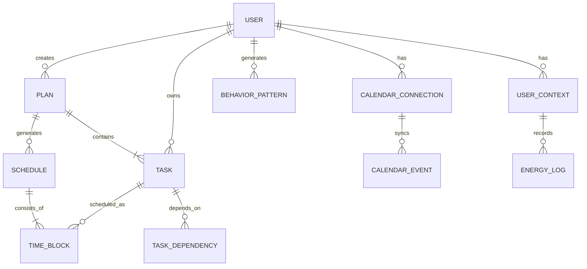

# Plan@Rea - AI 项目管理应用

## 项目原型文档

> **Plan@Rea** - "We'll plan so you are ready!"
> 
> AI驱动的智能项目管理应用，将目标转换为可执行计划，自动安排到日常生活中。

---

## 目录

1. [项目概述](#1-项目概述)
2. [系统架构](#2-系统架构)
3. [技术栈](#3-技术栈)
4. [目录结构](#4-目录结构)
5. [核心功能模块](#5-核心功能模块)
6. [数据模型](#6-数据模型)
7. [API 设计](#7-api-设计)
8. [用户界面流程](#8-用户界面流程)
9. [实现路线图](#9-实现路线图)

---

## 1. 项目概述

### 1.1 核心定位

Plan@Rea 是一款**AI-Auto Execution Project Manager**，解决"我知道该做什么，但我就是做不到"的执行力问题。

### 1.2 解决的问题

| 痛点 | 现有工具 | Plan@Rea 解决方案 |
|------|----------|-------------------|
| 大任务让人不知所措 | 需要手动拆解 | AI自动分解为小任务 |
| 计划与日程脱节 | 静态日历 | 动态情境感知调度 |
| 缺乏执行力 | 简单提醒 | 基于状态的智能提醒 |
| 动力容易流失 | 无心理支持 | 抗动力流失设计 |

### 1.3 核心创新点

- **Zero Effort Planning**: 输入目标/文档，AI生成完整计划
- **Context-Aware Scheduling**: 根据用户状态、位置、时间动态调整
- **Anti-Motivation Drop Design**: "Just Start"模式、进度可视化

---

## 2. 系统架构

```
┌─────────────────────────────────────────────────────────────────┐
│                        用户界面层 (Frontend)                      │
│  ┌─────────────┐ ┌─────────────┐ ┌─────────────┐ ┌──────────┐  │
│  │   Dashboard │ │   Planner   │ │  Calendar   │ │ Profile  │  │
│  └─────────────┘ └─────────────┘ └─────────────┘ └──────────┘  │
└─────────────────────────────────────────────────────────────────┘
                              │
                              ▼
┌─────────────────────────────────────────────────────────────────┐
│                        API 网关层                                │
│  ┌─────────────┐ ┌─────────────┐ ┌─────────────┐ ┌──────────┐  │
│  │    Auth     │ │   Rate      │ │   Logging   │ │  CORS    │  │
│  │   Service   │ │   Limiter   │ │  & Monitor  │ │ Handler  │  │
│  └─────────────┘ └─────────────┘ └─────────────┘ └──────────┘  │
└─────────────────────────────────────────────────────────────────┘
                              │
                              ▼
┌─────────────────────────────────────────────────────────────────┐
│                        业务服务层 (Backend)                       │
│                                                                 │
│  ┌─────────────────┐  ┌─────────────────┐  ┌─────────────────┐ │
│  │   AI Planning   │  │   Scheduling    │  │   Notification  │ │
│  │     Service     │  │     Engine      │  │     Service     │ │
│  └─────────────────┘  └─────────────────┘  └─────────────────┘ │
│                                                                 │
│  ┌─────────────────┐  ┌─────────────────┐  ┌─────────────────┐ │
│  │  Task Manager   │  │  Context Sync   │  │  Habit Learning │ │
│  │     Service     │  │    Service      │  │     Service     │ │
│  └─────────────────┘  └─────────────────┘  └─────────────────┘ │
│                                                                 │
└─────────────────────────────────────────────────────────────────┘
                              │
                              ▼
┌─────────────────────────────────────────────────────────────────┐
│                        数据存储层                                │
│  ┌─────────────┐ ┌─────────────┐ ┌─────────────┐ ┌──────────┐  │
│  │ PostgreSQL  │ │    Redis    │ │   Vector    │ │  Object  │  │
│  │  (Primary)  │ │   (Cache)   │ │    DB       │ │ Storage  │  │
│  └─────────────┘ └─────────────┘ └─────────────┘ └──────────┘  │
└─────────────────────────────────────────────────────────────────┘
                              │
                              ▼
┌─────────────────────────────────────────────────────────────────┐
│                        外部集成层                                │
│  ┌─────────────┐ ┌─────────────┐ ┌─────────────┐ ┌──────────┐  │
│  │ OpenAI API  │ │ Google Cal  │ │   Azure     │ │  Apple   │  │
│  │   /Claude   │ │    API      │ │   OpenAI    │ │ Calendar │  │
│  └─────────────┘ └─────────────┘ └─────────────┘ └──────────┘  │
└─────────────────────────────────────────────────────────────────┘
```

---

## 3. 技术栈

### 3.1 前端技术栈

| 类别 | 技术 | 用途 |
|------|------|------|
| 框架 | **Next.js 14** (App Router) | React SSR/SSG 框架 |
| 语言 | **TypeScript** | 类型安全 |
| 样式 | **Tailwind CSS** | 原子化CSS |
| 组件库 | **shadcn/ui** | UI组件基础 |
| 状态管理 | **Zustand** | 全局状态 |
| 服务端状态 | **TanStack Query** | 数据获取与缓存 |
| 动画 | **Framer Motion** | 交互动画 |
| 图表 | **Recharts** | 数据可视化 |
| PWA | **next-pwa** | 离线支持 |

### 3.2 后端技术栈

| 类别 | 技术 | 用途 |
|------|------|------|
| 运行时 | **Node.js 20+** / **Bun** | JavaScript运行时 |
| 框架 | **Next.js API Routes** / **Hono** | API服务 |
| ORM | **Prisma** | 数据库ORM |
| 认证 | **NextAuth.js** / **Lucia** | 用户认证 |
| AI SDK | **Vercel AI SDK** | AI流式响应 |
| 队列 | **BullMQ** | 任务队列 |

### 3.3 数据库与存储

| 类型 | 技术 | 用途 |
|------|------|------|
| 关系型 | **PostgreSQL** | 主数据库 |
| 缓存 | **Redis** | 会话、缓存、队列 |
| 向量 | **pgvector** / **Pinecone** | 语义搜索 |
| 对象存储 | **AWS S3** / **Cloudflare R2** | 文件存储 |

### 3.4 AI 与外部服务

| 服务 | 用途 |
|------|------|
| **OpenAI GPT-4o** / **Claude 3.5** | 任务分解、智能调度 |
| **Google Calendar API** | 日历同步 |
| **Microsoft Graph API** | Outlook日历 |
| **Firebase Cloud Messaging** | 推送通知 |
| **Vercel** / **Railway** | 部署平台 |

---

## 4. 目录结构

```
planrea/
├── 📁 apps/
│   ├── 📁 web/                          # Next.js 主应用
│   │   ├── 📁 app/                      # App Router
│   │   │   ├── 📁 (auth)/               # 认证路由组
│   │   │   │   ├── login/
│   │   │   │   ├── register/
│   │   │   │   └── layout.tsx
│   │   │   │
│   │   │   ├── 📁 (dashboard)/          # 主应用路由组
│   │   │   │   ├── 📁 dashboard/        # 仪表盘
│   │   │   │   │   ├── page.tsx
│   │   │   │   │   └── loading.tsx
│   │   │   │   │
│   │   │   │   ├── 📁 planner/          # 规划器
│   │   │   │   │   ├── page.tsx
│   │   │   │   │   └── 📁 [planId]/
│   │   │   │   │       └── page.tsx
│   │   │   │   │
│   │   │   │   ├── 📁 calendar/         # 日历视图
│   │   │   │   │   └── page.tsx
│   │   │   │   │
│   │   │   │   ├── 📁 tasks/            # 任务管理
│   │   │   │   │   ├── page.tsx
│   │   │   │   │   └── 📁 [taskId]/
│   │   │   │   │       └── page.tsx
│   │   │   │   │
│   │   │   │   ├── 📁 focus/            # 专注模式
│   │   │   │   │   └── page.tsx
│   │   │   │   │
│   │   │   │   ├── 📁 recovery/         # 恢复模式
│   │   │   │   │   └── page.tsx
│   │   │   │   │
│   │   │   │   ├── 📁 settings/         # 设置
│   │   │   │   │   ├── page.tsx
│   │   │   │   │   ├── profile/
│   │   │   │   │   ├── calendar/
│   │   │   │   │   ├── notifications/
│   │   │   │   │   └── ai-preferences/
│   │   │   │   │
│   │   │   │   └── layout.tsx
│   │   │   │
│   │   │   ├── 📁 api/                  # API路由
│   │   │   │   ├── auth/
│   │   │   │   ├── plans/
│   │   │   │   ├── tasks/
│   │   │   │   ├── schedule/
│   │   │   │   ├── calendar/
│   │   │   │   └── ai/
│   │   │   │
│   │   │   ├── layout.tsx
│   │   │   ├── page.tsx                 # Landing Page
│   │   │   └── globals.css
│   │   │
│   │   ├── 📁 components/               # React组件
│   │   │   ├── 📁 ui/                   # 基础UI组件
│   │   │   ├── 📁 layout/               # 布局组件
│   │   │   │   ├── Sidebar.tsx
│   │   │   │   ├── Header.tsx
│   │   │   │   ├── BottomNav.tsx
│   │   │   │   └── AppShell.tsx
│   │   │   │
│   │   │   ├── 📁 dashboard/            # 仪表盘组件
│   │   │   │   ├── TodaysFocus.tsx
│   │   │   │   ├── ProgressCard.tsx
│   │   │   │   ├── UpcomingTasks.tsx
│   │   │   │   └── EnergyLevelChart.tsx
│   │   │   │
│   │   │   ├── 📁 planner/              # 规划器组件
│   │   │   │   ├── GoalInput.tsx
│   │   │   │   ├── DocumentUploader.tsx
│   │   │   │   ├── TaskBreakdown.tsx
│   │   │   │   ├── TimelinePreview.tsx
│   │   │   │   └── AIGeneratingState.tsx
│   │   │   │
│   │   │   ├── 📁 calendar/             # 日历组件
│   │   │   │   ├── CalendarGrid.tsx
│   │   │   │   ├── TimeBlock.tsx
│   │   │   │   ├── ConflictResolver.tsx
│   │   │   │   └── SuggestedSlot.tsx
│   │   │   │
│   │   │   ├── 📁 tasks/                # 任务组件
│   │   │   │   ├── TaskCard.tsx
│   │   │   │   ├── TaskList.tsx
│   │   │   │   ├── JustStartMode.tsx
│   │   │   │   ├── ProgressBar.tsx
│   │   │   │   └── TaskDetailSheet.tsx
│   │   │   │
│   │   │   ├── 📁 focus/                # 专注模式组件
│   │   │   │   ├── FocusTimer.tsx
│   │   │   │   ├── DistractionBlocker.tsx
│   │   │   │   └── SessionComplete.tsx
│   │   │   │
│   │   │   ├── 📁 recovery/             # 恢复模式组件
│   │   │   │   ├── StressDetector.tsx
│   │   │   │   ├── BreathingExercise.tsx
│   │   │   │   ├── MiniGameCard.tsx
│   │   │   │   └── SuggestedBreak.tsx
│   │   │   │
│   │   │   └── 📁 shared/               # 共享组件
│   │   │       ├── LoadingSkeleton.tsx
│   │   │       ├── EmptyState.tsx
│   │   │       ├── ErrorBoundary.tsx
│   │   │       └── AnimatedNumber.tsx
│   │   │
│   │   ├── 📁 hooks/                    # 自定义Hooks
│   │   │   ├── useAuth.ts
│   │   │   ├── useTasks.ts
│   │   │   ├── useSchedule.ts
│   │   │   ├── useCalendar.ts
│   │   │   ├── useEnergyLevel.ts
│   │   │   ├── useNotifications.ts
│   │   │   └── useLocalStorage.ts
│   │   │
│   │   ├── 📁 lib/                      # 工具库
│   │   │   ├── utils.ts
│   │   │   ├── api.ts
│   │   │   ├── ai-client.ts
│   │   │   ├── calendar-sync.ts
│   │   │   └── date-helpers.ts
│   │   │
│   │   ├── 📁 stores/                   # Zustand状态
│   │   │   ├── auth-store.ts
│   │   │   ├── task-store.ts
│   │   │   ├── schedule-store.ts
│   │   │   └── ui-store.ts
│   │   │
│   │   ├── 📁 types/                    # TypeScript类型
│   │   │   ├── index.ts
│   │   │   ├── user.ts
│   │   │   ├── task.ts
│   │   │   ├── plan.ts
│   │   │   └── calendar.ts
│   │   │
│   │   ├── 📁 public/                   # 静态资源
│   │   │   ├── icons/
│   │   │   ├── images/
│   │   │   ├── manifest.json
│   │   │   └── service-worker.js
│   │   │
│   │   ├── middleware.ts
│   │   ├── next.config.js
│   │   ├── tailwind.config.ts
│   │   ├── tsconfig.json
│   │   └── package.json
│   │
│   └── 📁 mobile/                       # React Native (未来)
│
├── 📁 packages/
│   ├── 📁 shared/                       # 共享代码
│   │   ├── src/
│   │   │   ├── types/
│   │   │   ├── constants/
│   │   │   └── utils/
│   │   └── package.json
│   │
│   ├── 📁 ai-core/                      # AI核心逻辑
│   │   ├── src/
│   │   │   ├── prompt-engineering/
│   │   │   │   ├── task-breakdown.ts
│   │   │   │   ├── time-estimation.ts
│   │   │   │   └── scheduling.ts
│   │   │   ├── models/
│   │   │   │   ├── openai-client.ts
│   │   │   │   └── anthropic-client.ts
│   │   │   └── services/
│   │   │       ├── plan-generator.ts
│   │   │       └── schedule-optimizer.ts
│   │   └── package.json
│   │
│   ├── 📁 scheduling-engine/            # 调度引擎
│   │   ├── src/
│   │   │   ├── constraints/
│   │   │   │   ├── hard-constraints.ts
│   │   │   │   └── soft-constraints.ts
│   │   │   ├── optimizer/
│   │   │   │   ├── genetic-algorithm.ts
│   │   │   │   └── greedy-scheduler.ts
│   │   │   └── context/
│   │   │       ├── energy-predictor.ts
│   │   │       └── location-tracker.ts
│   │   └── package.json
│   │
│   └── 📁 ui-components/                # 共享UI组件
│       ├── src/
│       └── package.json
│
├── 📁 services/                         # 微服务
│   ├── 📁 notification-service/         # 通知服务
│   ├── 📁 calendar-sync-service/        # 日历同步服务
│   └── 📁 habit-learning-service/       # 习惯学习服务
│
├── 📁 infrastructure/                   # 基础设施
│   ├── docker/
│   ├── kubernetes/
│   └── terraform/
│
├── 📁 docs/                             # 文档
│   ├── api/
│   ├── architecture/
│   └── user-guides/
│
├── .gitignore
├── turbo.json                           # Turborepo配置
├── package.json
└── README.md
```

---

## 5. 核心功能模块

### 5.1 AI 规划模块 (AI Planning Module)

```typescript
// 核心功能
interface AIPlanningModule {
  // 1. 目标解析
  parseGoal(input: GoalInput): Promise<ParsedGoal>;
  
  // 2. 任务分解
  breakdownTasks(goal: ParsedGoal): Promise<Task[]>;
  
  // 3. 时间估算
  estimateDuration(task: Task): Promise<number>;
  
  // 4. 优先级排序
  prioritizeTasks(tasks: Task[]): Task[];
  
  // 5. 生成计划
  generatePlan(config: PlanConfig): Promise<Plan>;
}

// 输入类型
interface GoalInput {
  type: 'text' | 'document' | 'audio' | 'image';
  content: string | File;
  deadline: Date;
  constraints?: string[];
}
```

**Prompt 工程策略：**

```typescript
// 任务分解 Prompt
const TASK_BREAKDOWN_PROMPT = `
你是一个专业的项目管理专家。请将以下目标分解为可执行的具体任务。

目标: {goal}
截止日期: {deadline}
可用时间: {availableHours}小时/周

要求:
1. 每个任务应该可以在25-90分钟内完成（番茄工作法）
2. 明确任务之间的依赖关系
3. 考虑用户的精力曲线
4. 预留缓冲时间（20%）

输出格式（JSON）:
{
  "tasks": [
    {
      "id": "string",
      "title": "string",
      "description": "string",
      "estimatedMinutes": number,
      "priority": "high" | "medium" | "low",
      "dependencies": ["taskId"],
      "energyLevel": "high" | "medium" | "low",
      "category": "string"
    }
  ]
}
`;
```

### 5.2 情境感知调度引擎 (Context-Aware Scheduling Engine)

```typescript
interface SchedulingEngine {
  // 核心调度算法
  scheduleTasks(
    tasks: Task[],
    context: UserContext,
    constraints: SchedulingConstraints
  ): Promise<Schedule>;
  
  // 实时调整
  adaptSchedule(
    event: ScheduleEvent,
    currentSchedule: Schedule
  ): Promise<Schedule>;
  
  // 优化建议
  suggestOptimization(schedule: Schedule): OptimizationSuggestion[];
}

interface UserContext {
  // 硬约束
  hardConstraints: {
    calendarEvents: CalendarEvent[];  // 课程、会议
    fixedCommitments: TimeBlock[];
  };
  
  // 软行为信号
  softSignals: {
    currentEnergyLevel: EnergyLevel;
    location: Location;  // home, office, commute
    typicalPatterns: BehaviorPattern[];
    recentProductivity: number;  // 0-1
  };
  
  // 实时状态
  realTimeState: {
    currentTask?: Task;
    lastBreak: Date;
    stressLevel: StressLevel;
  };
}
```

**调度算法流程：**

```
1. 收集约束
   ├── 导入日历事件（硬约束）
   ├── 获取用户行为模式
   └── 检测当前状态

2. 时间块分配
   ├── 识别空闲时间块
   ├── 根据精力水平匹配任务
   └── 预留缓冲时间

3. 优化调整
   ├── 检查任务依赖
   ├── 平衡工作负载
   └── 生成备选方案

4. 实时监控
   ├── 追踪任务完成状态
   ├── 检测偏离计划
   └── 触发重新调度
```

### 5.3 抗动力流失系统 (Anti-Motivation Drop System)

```typescript
interface MotivationSystem {
  // "Just Start" 模式
  activateJustStartMode(user: User): MicroTask;
  
  // 进度可视化
  calculateProgress(plan: Plan): ProgressMetrics;
  
  // 动力检测
  detectMotivationDrop(user: User): boolean;
  
  // 干预策略
  applyIntervention(type: InterventionType): void;
}

interface InterventionType {
  type: 'micro-task' | 'celebration' | 'break-suggestion' | 'encouragement';
  content: string;
  action?: () => void;
}
```

**干预策略示例：**

| 场景 | 检测条件 | 干预措施 |
|------|----------|----------|
| 启动困难 | 任务创建后2小时未开始 | "Just Start"模式：只显示第一个5分钟任务 |
| 中途放弃 | 连续跳过3个任务 | 提醒已完成的68%，建议小休息 |
| 过度疲劳 | 连续工作>90分钟 | 强制休息建议，提供呼吸练习 |
| 完美主义 | 任务反复修改>5次 | "完成比完美重要"提示 |

### 5.4 放松与恢复模块 (Recovery Module)

```typescript
interface RecoveryModule {
  // 压力检测
  detectStressLevel(user: User): StressLevel;
  
  // 工作负载追踪
  trackWorkload(userId: string): WorkloadMetrics;
  
  // 恢复建议
  suggestRecoveryActivity(stressLevel: StressLevel): RecoveryActivity;
  
  // 内置小游戏
  miniGames: MiniGame[];
}

interface RecoveryActivity {
  type: 'breathing' | 'stretching' | 'mindfulness' | 'game' | 'walk';
  duration: number;
  instructions: string[];
  benefits: string;
}
```

---

## 6. 数据模型

### 6.1 核心实体关系



### 6.2 数据库 Schema (Prisma)

```prisma
// schema.prisma

generator client {
  provider = "prisma-client-js"
}

datasource db {
  provider = "postgresql"
  url      = env("DATABASE_URL")
}

// 用户模型
model User {
  id            String    @id @default(cuid())
  email         String    @unique
  name          String?
  avatar        String?
  
  // 偏好设置
  preferences   UserPreferences?
  
  // 关联
  plans         Plan[]
  tasks         Task[]
  calendarConnections CalendarConnection[]
  behaviorPatterns BehaviorPattern[]
  energyLogs    EnergyLog[]
  
  createdAt     DateTime  @default(now())
  updatedAt     DateTime  @updatedAt
}

// 用户偏好
model UserPreferences {
  id                    String   @id @default(cuid())
  userId                String   @unique
  user                  User     @relation(fields: [userId], references: [id])
  
  // 工作偏好
  workHoursStart        Int      @default(9)  // 24小时制
  workHoursEnd          Int      @default(18)
  preferredSessionLength Int     @default(25) // 分钟
  breakDuration         Int      @default(5)
  
  // 通知设置
  notificationEnabled   Boolean  @default(true)
  reminderTime          Int      @default(15) // 提前15分钟
  
  // AI偏好
  aiModel               String   @default("gpt-4o")
  planningStyle         String   @default("balanced") // aggressive, balanced, relaxed
  
  createdAt             DateTime @default(now())
  updatedAt             DateTime @updatedAt
}

// 计划
model Plan {
  id            String    @id @default(cuid())
  userId        String
  user          User      @relation(fields: [userId], references: [id])
  
  title         String
  description   String?
  goal          String    // 原始目标
  deadline      DateTime
  
  // 状态
  status        PlanStatus @default(ACTIVE)
  progress      Float      @default(0) // 0-100
  
  // 关联
  tasks         Task[]
  schedules     Schedule[]
  
  createdAt     DateTime  @default(now())
  updatedAt     DateTime  @updatedAt
}

enum PlanStatus {
  DRAFT
  ACTIVE
  PAUSED
  COMPLETED
  ARCHIVED
}

// 任务
model Task {
  id              String    @id @default(cuid())
  userId          String
  user            User      @relation(fields: [userId], references: [id])
  planId          String?
  plan            Plan?     @relation(fields: [planId], references: [id])
  
  title           String
  description     String?
  
  // 时间估算
  estimatedMinutes Int
  actualMinutes   Int?
  
  // 优先级和精力
  priority        Priority  @default(MEDIUM)
  energyLevel     EnergyLevel @default(MEDIUM)
  
  // 分类
  category        String?
  tags            String[]
  
  // 状态
  status          TaskStatus @default(PENDING)
  
  // 依赖
  dependencies    TaskDependency[] @relation("TaskDependencies")
  dependents      TaskDependency[] @relation("TaskDependents")
  
  // 调度
  timeBlocks      TimeBlock[]
  
  // 元数据
  sourceDocument  String?   // 来源文档（如果是从文档提取）
  aiGenerated     Boolean   @default(false)
  
  createdAt       DateTime  @default(now())
  updatedAt       DateTime  @updatedAt
}

enum Priority {
  LOW
  MEDIUM
  HIGH
  URGENT
}

enum EnergyLevel {
  LOW
  MEDIUM
  HIGH
}

enum TaskStatus {
  PENDING
  SCHEDULED
  IN_PROGRESS
  COMPLETED
  SKIPPED
  DEFERRED
}

// 任务依赖
model TaskDependency {
  id          String @id @default(cuid())
  taskId      String
  task        Task   @relation("TaskDependencies", fields: [taskId], references: [id])
  dependsOnId String
  dependsOn   Task   @relation("TaskDependents", fields: [dependsOnId], references: [id])
  
  @@unique([taskId, dependsOnId])
}

// 日历连接
model CalendarConnection {
  id            String    @id @default(cuid())
  userId        String
  user          User      @relation(fields: [userId], references: [id])
  
  provider      String    // google, outlook, apple
  accessToken   String    @encrypted
  refreshToken  String?   @encrypted
  
  isActive      Boolean   @default(true)
  lastSyncedAt  DateTime?
  
  calendarEvents CalendarEvent[]
  
  createdAt     DateTime  @default(now())
  updatedAt     DateTime  @updatedAt
}

// 日历事件（硬约束）
model CalendarEvent {
  id          String    @id @default(cuid())
  connectionId String
  connection  CalendarConnection @relation(fields: [connectionId], references: [id])
  
  externalId  String    // 来自第三方日历的ID
  title       String
  startTime   DateTime
  endTime     DateTime
  isAllDay    Boolean   @default(false)
  
  createdAt   DateTime  @default(now())
  updatedAt   DateTime  @updatedAt
}

// 时间表
model Schedule {
  id          String    @id @default(cuid())
  planId      String
  plan        Plan      @relation(fields: [planId], references: [id])
  
  version     Int       @default(1)
  isActive    Boolean   @default(true)
  
  timeBlocks  TimeBlock[]
  
  createdAt   DateTime  @default(now())
  updatedAt   DateTime  @updatedAt
}

// 时间块（任务调度结果）
model TimeBlock {
  id          String    @id @default(cuid())
  scheduleId  String
  schedule    Schedule  @relation(fields: [scheduleId], references: [id])
  taskId      String
  task        Task      @relation(fields: [taskId], references: [id])
  
  startTime   DateTime
  endTime     DateTime
  isFlexible  Boolean   @default(false) // 是否可以移动
  
  status      TimeBlockStatus @default(SCHEDULED)
  
  createdAt   DateTime  @default(now())
}

enum TimeBlockStatus {
  SCHEDULED
  IN_PROGRESS
  COMPLETED
  SKIPPED
  RESCHEDULED
}

// 用户行为模式
model BehaviorPattern {
  id          String    @id @default(cuid())
  userId      String
  user        User      @relation(fields: [userId], references: [id])
  
  // 时间段
  dayOfWeek   Int       // 0-6
  hourOfDay   Int       // 0-23
  
  // 典型行为
  productivityScore Float // 0-1
  typicalActivity String // focus, scroll, break, commute
  location    String?   // home, office, etc.
  
  confidence  Float     // 模式的可信度
  
  updatedAt   DateTime  @updatedAt
  
  @@unique([userId, dayOfWeek, hourOfDay])
}

// 精力日志
model EnergyLog {
  id          String    @id @default(cuid())
  userId      String
  user        User      @relation(fields: [userId], references: [id])
  
  recordedAt  DateTime
  energyLevel EnergyLevel
  context     Json?     // 位置、活动、时间等
  
  createdAt   DateTime  @default(now())
}
```

---

## 7. API 设计

### 7.1 RESTful API 规范

#### 认证相关

```http
POST   /api/auth/register
POST   /api/auth/login
POST   /api/auth/logout
GET    /api/auth/session
POST   /api/auth/refresh
```

#### 计划管理

```http
GET    /api/plans              # 获取所有计划
POST   /api/plans              # 创建新计划
GET    /api/plans/:id          # 获取计划详情
PATCH  /api/plans/:id          # 更新计划
DELETE /api/plans/:id          # 删除计划

POST   /api/plans/:id/generate # AI生成任务
POST   /api/plans/:id/activate # 激活计划
```

#### 任务管理

```http
GET    /api/tasks              # 获取任务列表
POST   /api/tasks              # 创建任务
GET    /api/tasks/:id          # 获取任务详情
PATCH  /api/tasks/:id          # 更新任务
DELETE /api/tasks/:id          # 删除任务

POST   /api/tasks/:id/start    # 开始任务
POST   /api/tasks/:id/complete # 完成任务
POST   /api/tasks/:id/skip     # 跳过任务
POST   /api/tasks/:id/defer    # 推迟任务
```

#### 调度相关

```http
GET    /api/schedule           # 获取当前调度
POST   /api/schedule/generate  # 生成新调度
POST   /api/schedule/adapt     # 自适应调整
GET    /api/schedule/suggest   # 获取优化建议

GET    /api/calendar/sync      # 同步日历
POST   /api/calendar/connect   # 连接日历账户
```

#### AI 相关

```http
POST   /api/ai/breakdown       # 任务分解
POST   /api/ai/estimate        # 时间估算
POST   /api/ai/chat            # AI助手对话
```

### 7.2 WebSocket 事件

```typescript
// 实时调度更新
interface ScheduleUpdateEvent {
  type: 'SCHEDULE_UPDATED';
  payload: {
    scheduleId: string;
    changes: ScheduleChange[];
    reason: string;
  };
}

// 任务提醒
interface TaskReminderEvent {
  type: 'TASK_REMINDER';
  payload: {
    taskId: string;
    message: string;
    context: string; // "你在家，有空，通常在刷手机..."
  };
}

// 动力流失检测
interface MotivationDropEvent {
  type: 'MOTIVATION_DROP_DETECTED';
  payload: {
    interventionType: string;
    suggestion: string;
  };
}
```

---

## 8. 用户界面流程

### 8.1 核心用户旅程

```
┌─────────┐     ┌─────────┐     ┌─────────┐     ┌─────────┐
│  Landing │────▶│  Sign   │────▶│ Onboard │────▶│ Dashboard│
│   Page   │     │   Up    │     │   ing   │     │          │
└─────────┘     └─────────┘     └─────────┘     └─────────┘
                                                        │
    ┌───────────────────────────────────────────────────┘
    ▼
┌─────────┐     ┌─────────┐     ┌─────────┐
│ Create  │────▶│   AI    │────▶│ Review  │
│  Plan   │     │Generate │     │ & Edit  │
└─────────┘     └─────────┘     └─────────┘
                                        │
    ┌───────────────────────────────────┘
    ▼
┌─────────┐     ┌─────────┐     ┌─────────┐
│ Activate│────▶│ Execute │────▶│ Complete│
│ Schedule│     │  Tasks  │     │  Plan   │
└─────────┘     └─────────┘     └─────────┘
```

### 8.2 关键界面设计

#### 1. 仪表盘 (Dashboard)

```
┌─────────────────────────────────────────────────────────────┐
│  Plan@Rea                                    [👤] [⚙️] [🔔]  │
├─────────────────────────────────────────────────────────────┤
│                                                             │
│  👋 早上好，Alex！今天是完成论文的好日子                    │
│                                                             │
│  ┌─────────────────────────────────────────────────────┐   │
│  │  🎯 今日专注                                         │   │
│  │                                                     │   │
│  │  论文第三章 - 文献综述                        [开始] │   │
│  │  ⏱️ 建议时长: 50分钟  📍 地点: 图书馆               │   │
│  │  💡 提示: 你现在精力充沛，适合深度工作               │   │
│  └─────────────────────────────────────────────────────┘   │
│                                                             │
│  📊 本周进度                                          68%   │
│  ████████████████████░░░░░░░░░░░░░░                       │
│                                                             │
│  ⏰ 接下来                                              [+] │
│  ┌─────────────────────────────────────────────────────┐   │
│  │ 2:00 PM  📊 数据分析                        25分钟  │   │
│  │ 3:00 PM  ☕ 休息                            15分钟  │   │
│  │ 3:15 PM  📝 撰写引言                        45分钟  │   │
│  └─────────────────────────────────────────────────────┘   │
│                                                             │
│  📈 能量曲线                                                │
│     ▲                                                       │
│  高 │    ╱╲        ╱╲                                      │
│     │   ╱  ╲      ╱  ╲    ╱╲                              │
│  中 │──╱────╲────╱────╲──╱──╲───────────                 │
│     │ ╱      ╲  ╱      ╲╱    ╲                            │
│  低 │╱        ╲╱                  ╲                       │
│     └────────────────────────────────────▶                 │
│       6   8   10  12  2   4   6   8                        │
│                                                             │
└─────────────────────────────────────────────────────────────┘
```

#### 2. AI 规划器 (Planner)

```
┌─────────────────────────────────────────────────────────────┐
│  ← 返回                                     创建新计划      │
├─────────────────────────────────────────────────────────────┤
│                                                             │
│  你的目标是什么？                                           │
│                                                             │
│  ┌─────────────────────────────────────────────────────┐   │
│  │  我想在两周内完成硕士论文初稿...                    │   │
│  └─────────────────────────────────────────────────────┘   │
│                                                             │
│  或上传文档 📎                                            │
│                                                             │
│  ─────────── 或 ───────────                                 │
│                                                             │
│  📤 拖放文件到这里                                          │
│     支持 PDF, Word, 图片, 音频                             │
│                                                             │
│  ─────────────────────────────────────────────────────     │
│                                                             │
│  截止日期: [📅 2024-06-30]                                  │
│                                                             │
│  每周可用时间: [══════░░░░░░░░] 约20小时                   │
│                                                             │
│              [     🤖 AI 生成计划     ]                     │
│                                                             │
│  ━━━━━━━━━━━━━━━━━━━━━━━━━━━━━━━━━━━━━━━━━━━━━━━━━━━━      │
│                                                             │
│  🔄 AI正在分析你的目标...                                   │
│  ✓ 识别主要任务                                             │
│  ✓ 估算时间需求                                             │
│  → 优化任务顺序...                                          │
│                                                             │
└─────────────────────────────────────────────────────────────┘
```

#### 3. "Just Start" 模式

```
┌─────────────────────────────────────────────────────────────┐
│                                                             │
│                                                             │
│                    🌟 Just Start 模式                       │
│                                                             │
│              不用想太多，先做这一件小事                     │
│                                                             │
│     ┌─────────────────────────────────────────┐             │
│     │                                         │             │
│     │     📖 打开论文文档                     │             │
│     │                                         │             │
│     │     只需找到上次离开的位置              │             │
│     │     不需要写任何东西                    │             │
│     │                                         │             │
│     │           [ 我做到了 ✓ ]                │             │
│     │                                         │             │
│     └─────────────────────────────────────────┘             │
│                                                             │
│                 ⏱️ 只需要 2 分钟                            │
│                                                             │
│                                                             │
│     💡 你知道吗？68% 的人一旦开始，就会继续下去             │
│                                                             │
│                                                             │
└─────────────────────────────────────────────────────────────┘
```

#### 4. 恢复模式 (Recovery Mode)

```
┌─────────────────────────────────────────────────────────────┐
│  🧘 恢复模式                                                │
├─────────────────────────────────────────────────────────────┤
│                                                             │
│  检测到你可能有些疲劳                                       │
│  工作负载: ████████░░ 较高                                  │
│                                                             │
│  选择一个快速恢复活动：                                     │
│                                                             │
│  ┌─────────────┐ ┌─────────────┐ ┌─────────────┐           │
│  │   🫁        │ │   🧘        │ │   🎮        │           │
│  │   呼吸      │ │   冥想      │ │   小游戏    │           │
│  │   2分钟     │ │   5分钟     │ │   10分钟    │           │
│  └─────────────┘ └─────────────┘ └─────────────┘           │
│                                                             │
│  ┌─────────────────────────────────────────────────────┐   │
│  │                                                     │   │
│  │   推荐：4-7-8 呼吸法                                │   │
│  │                                                     │   │
│  │   [动画演示]                                        │   │
│  │                                                     │   │
│  │   吸气 4秒 → 屏息 7秒 → 呼气 8秒                   │   │
│  │                                                     │   │
│  │              [ 开始练习 ]                           │   │
│  │                                                     │   │
│  └─────────────────────────────────────────────────────┘   │
│                                                             │
│  💤 或者：小睡 20 分钟                                      │
│                                                             │
└─────────────────────────────────────────────────────────────┘
```

---

## 9. 实现路线图

### Phase 1: MVP (4-6 周)

**目标**: 验证核心假设，让用户能创建计划并看到任务

| 周 | 任务 | 产出 |
|----|------|------|
| 1-2 | 项目搭建 + 认证系统 | 可登录的Web应用 |
| 3 | AI任务分解 + 基础UI | 输入目标生成任务列表 |
| 4 | 简单日历视图 + 任务管理 | 任务CRUD + 日历展示 |
| 5-6 | Google Calendar集成 + 部署 | MVP上线 |

**MVP功能清单:**
- [ ] 用户注册/登录
- [ ] AI任务分解（文本输入）
- [ ] 任务列表管理
- [ ] 简单日历视图
- [ ] Google Calendar同步（只读）

---

### Phase 2: 核心调度引擎 (4-6 周)

**目标**: 实现情境感知调度和基础智能提醒

| 周 | 任务 | 产出 |
|----|------|------|
| 1-2 | 调度算法 + 约束管理 | 自动生成日程安排 |
| 3 | 实时适应系统 | 任务跳过/完成时自动调整 |
| 4 | 智能提醒系统 | 上下文感知通知 |
| 5-6 | 移动端适配 + PWA | 移动端可用 |

**新增功能:**
- [ ] 自动日程生成
- [ ] 硬约束管理（课程/会议）
- [ ] 实时调度调整
- [ ] 智能提醒（非烦人通知）
- [ ] PWA离线支持

---

### Phase 3: 智能优化 (4-6 周)

**目标**: 引入精力管理和动力维持功能

| 周 | 任务 | 产出 |
|----|------|------|
| 1-2 | 能量追踪 + 任务匹配 | 根据精力推荐任务 |
| 3 | "Just Start" 模式 | 降低启动阻力功能 |
| 4 | 进度可视化 + 庆祝系统 | 激励机制 |
| 5-6 | 放松模式 + 小游戏 | 恢复功能 |

**新增功能:**
- [ ] 能量水平记录
- [ ] 任务-能量匹配
- [ ] "Just Start" 模式
- [ ] 进度可视化
- [ ] 恢复模式 + 小游戏
- [ ] 习惯学习（基础）

---

### Phase 4: 高级功能 (持续迭代)

**目标**: 完善产品，增加协作和深度功能

- [ ] 团队协作
- [ ] 高级习惯学习
- [ ] 多日历深度集成
- [ ] 语音输入
- [ ] 数据分析仪表板
- [ ] API开放平台

---

## 附录

### A. 技术选型理由

| 技术 | 选择理由 |
|------|----------|
| Next.js 14 | SSR支持SEO，App Router简化API开发，Vercel生态 |
| Tailwind CSS | 快速UI开发，一致的设计系统，小bundle size |
| shadcn/ui | 可定制组件，不锁定，良好的无障碍支持 |
| Zustand | 简单，无样板代码，TypeScript友好 |
| Prisma | 类型安全，迁移管理，良好的开发者体验 |
| PostgreSQL | 可靠，JSON支持，pgvector扩展 |

### B. 性能指标目标

| 指标 | 目标 |
|------|------|
| 首屏加载时间 | < 2s |
| AI响应时间 | < 3s |
| 调度生成时间 | < 1s |
| 日历同步延迟 | < 5s |
| 移动端Lighthouse | > 90 |

### C. 安全考虑

- 所有API使用HTTPS
- JWT token + 刷新机制
- 敏感数据加密存储
- AI输入输出过滤
- 日历权限最小化

---

*文档版本: 1.0*  
*最后更新: 2024年*  
*作者: Team A (404)*
